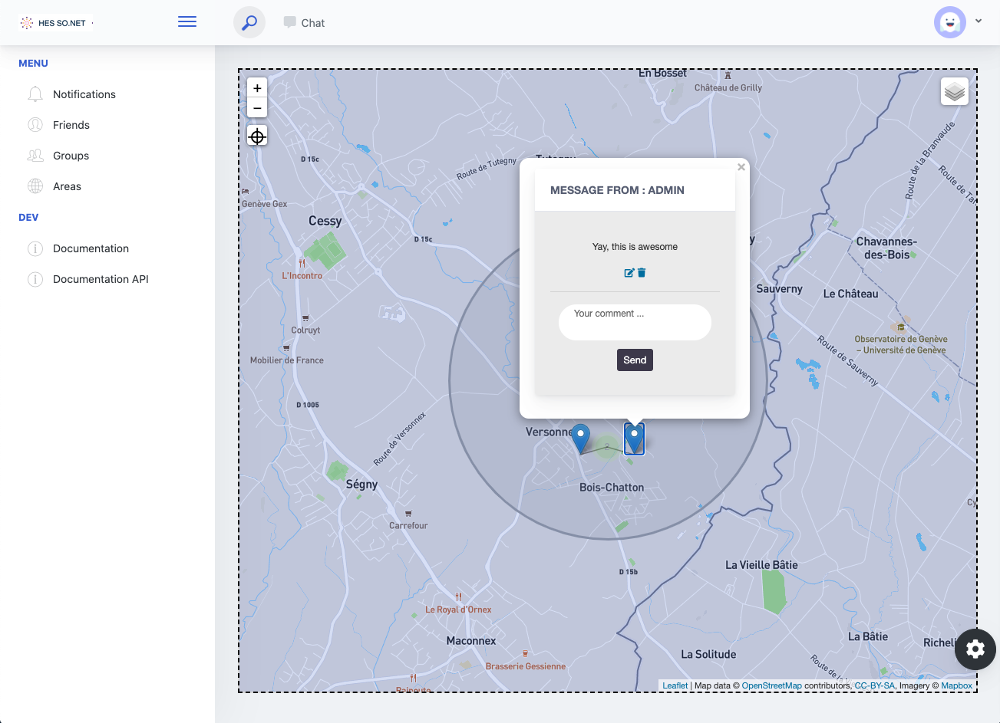

# HES-SO.NET

HESSN is a social network allowing users to :
- post and view ephemeral messages at specific locations
- add friends and chat with them
- join specific group



**Authors :** 

- Maxime Hutinet
- José Neto Gonçalves
- Justin Foltz
- Carina Inacio Oliviera
- Guillaume Riondet

# The project

The project has been built with different technologies :

- Django for the API REST, HTTP server and Websocket server
- HTML/CSS, JavaScript/JQuery, Bootstrap for the website
- RabbitMQ for the notification system
- PostgresSQL for the database

# How to run the project ?

## Requirements

To run the project, the followings must be installed on the machine :

- Docker
- Docker-compose

## Running the project

1. Clone the repository

2. Run Docker Compose with the following command

```bash
docker-compose up -d
```

3. Open a browser and navigate to `http://localhost:8001/admin/`

4. Log in with the following credentials :

`username` : `admin`

`password` : `admin`

5. Navigate to Backend > Visibilitys

6. Add the three following visibilities in order :

- Public
- Semi Private
- Private

7. You can now sign up to the website by navigating to `http://localhost:8001/signup`

## Destorying the environment

1. Run :

```bash
docker-compose down
```
